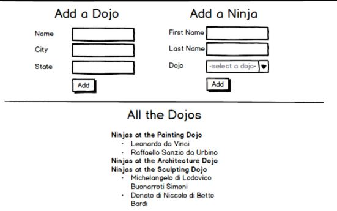

# Python_Dojo_Ninjas
A Python application with 2 classes: Dojo and Ninja. A ninja could be connected to a Dojo, and a Dojo can have multiple Ninjas. The list of Dojos and their Ninjas is listed in a template.

